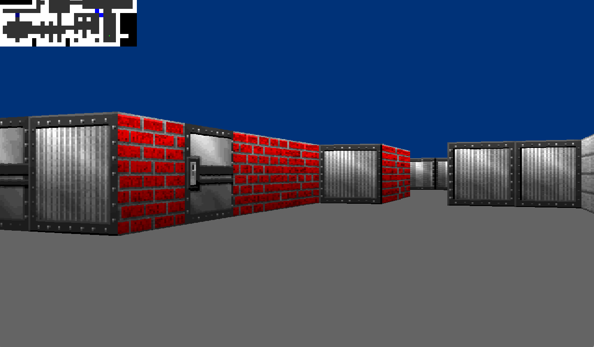

# 42-cube3d-collab (First Person Shooter with Raycasting)
This School 42 project objective was to recreate from scratch a Wolfenstein 3D-like raycaster engine. The raycasting procedure allows a simplified rendering of 3D scenes in real-time. The display is performed via the minimal library "minilibX" that allows to create a window and to display an image buffer into it. The library also allows to capture mouse and keyboard events.
Our raycaster supports several features such as:
* texture rendering on walls
* use of the mouse for player rotation
* presence of doors in the map
* rendering of a moving sprite
* display of a minimap

